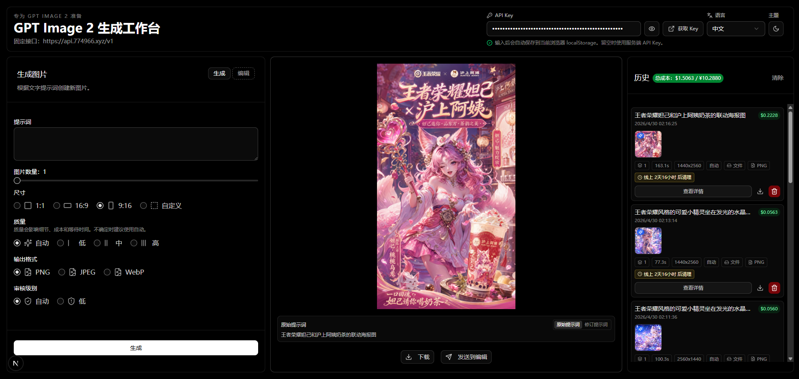
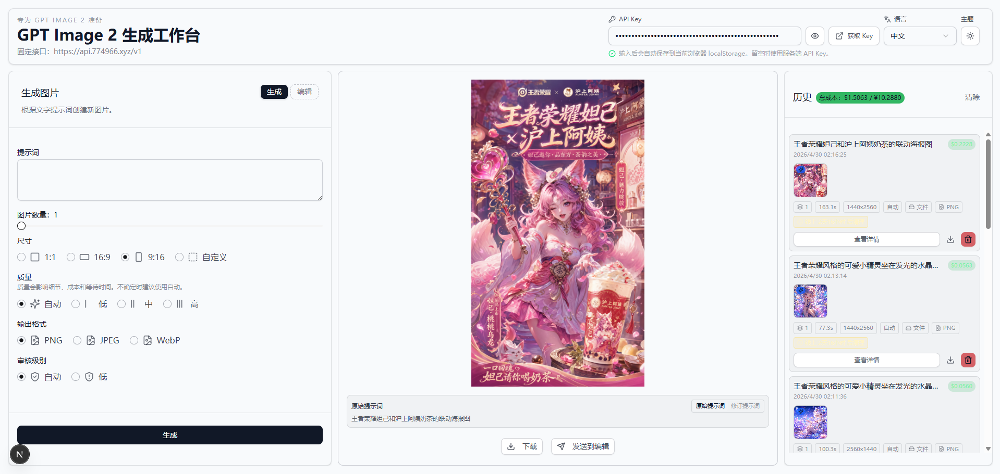
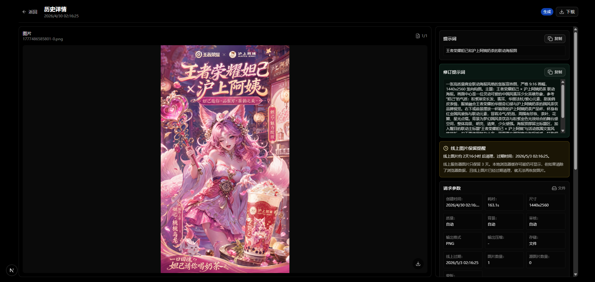

<div align="center">
  
  <h1>GPT Image Playground</h1>
  <p>基于 Next.js 的 GPT Image 生成与编辑工作台</p>
  <p>支持 OpenAI 兼容接口、图片生成、图片编辑、历史详情、成本估算、人民币换算与本站额度价值对比。</p>
  <p>
    
    
    
  </p>
  <p>
    
    
    
    
  </p>
</div>

## 项目简介

GPT Image Playground 是一个面向 `gpt-image-2` 的单页图片生成与编辑工作台。默认模型为 `gpt-image-2`，API Key 可直接在首页顶部填写，Base URL 由服务端环境变量配置。

API Key 只会保存在当前浏览器的 `localStorage` 中，不会做服务器持久化存储。发起生成或编辑时，浏览器会把本地 API Key 发送给本应用后端接口；Base URL 则由服务端 `OPENAI_API_BASE_URL` 提供，用于请求 OpenAI 兼容 API。

## 界面预览

### 首页 · 暗色主题

<p align="center">
  
</p>

### 首页 · 浅色主题

<p align="center">
  
</p>

### 历史详情

<p align="center">
  
</p>

## 功能特性

- 图片生成：输入提示词生成图片，支持多图批量输出；如果接口返回数量少于所选数量，会自动补请求缺少的图片。
- 图片编辑：上传或粘贴参考图，使用提示词进行编辑。
- 蒙版工具：可在页面内绘制蒙版，也可以上传 PNG 蒙版。
- 尺寸选择：默认 `1:1`，支持 `16:9`、`9:16` 和自定义尺寸。
- 构图约束：请求会按所选尺寸自动补充画布方向约束，降低 16:9 被模型改写成手机竖屏、9:16 被改写成横图的概率。
- 专用模型：前端固定使用 `gpt-image-2`，不需要用户选择模型。
- 首页 API 配置：可在首页顶部填写 API Key，自动保存到当前浏览器 localStorage，并提供获取 Key 的快捷入口。
- Base URL：由服务端环境变量 `OPENAI_API_BASE_URL` 配置，页面仅展示当前值，不允许在前端修改。
- 主题与语言：首页右上角支持中文 / English 与浅色 / 深色切换。
- 实时计时：点击生成后会显示本次请求已耗时。
- 图片预览与下载：生成结果、历史列表和详情页均支持下载图片，多图结果支持左右切换和网格查看。
- 历史记录：历史元数据保存在浏览器 localStorage，生成后的图片会缓存到浏览器 IndexedDB，并可按配置保存到服务端文件系统。
- 修订提示词：默认显示用户输入的原始提示词；如果接口返回 `revised_prompt`，当前结果和历史详情可切换查看模型实际采用的修订提示词，并会按当前界面语言向上游传递语言偏好。
- 线上过期提醒：根据生成时间计算下一次每天凌晨 3 点（UTC+8）的清理时间，提醒用户及时下载。
- 历史详情页：查看图片、提示词、请求参数、过期提醒、耗时、尺寸、格式、成本和额度对比。
- 成本估算：按 API usage 和模型 token 单价估算美元成本，并显示人民币换算。
- 额度价值对比：按本站 `¥1 = 20 张图` 计算单图 `¥0.05`，对比官方估算成本，展示大约节省金额和划算倍数。

## 历史与成本

历史列表会记录每次生成或编辑的关键信息，包括生成时间、模型、尺寸、质量、背景、审核级别、输出格式、耗时、图片数量、原始提示词、修订提示词和成本明细。

点击历史列表中的某张缩略图会在中间预览区直接切换到对应图片；多图结果也支持在预览区通过左右箭头、底部缩略图和网格按钮切换。

线上服务器图片会在每天凌晨 3 点（UTC+8）统一清理。页面会根据历史记录里的生成时间实时计算下一次清理时间，并在历史列表和详情页提醒还剩多久清理。重要图片请在过期前下载保存。

成本展示包含三类信息：

- 官方估算成本：根据接口返回的 usage 与模型单价计算。
- 人民币换算：使用固定估算汇率展示 `USD / RMB`。
- 本站额度价：按 `¥1 = 20 张图` 计算，帮助用户直观看到额度价值。

> 说明：官方价格常量写在 `src/lib/cost-utils.ts` 中，不会实时抓取官方价格；如官方定价变化，需要同步更新该文件。

## 蒙版编辑

编辑模式支持直接在图片上涂抹生成蒙版，适合指定局部修改区域。

## 存储说明

项目支持两种图片存储模式，通过 `NEXT_PUBLIC_IMAGE_STORAGE_MODE` 控制：

- `fs`：默认模式，图片保存到服务端 `generated-images` 目录。
- `indexeddb`：图片保存到当前浏览器 IndexedDB，适合 Vercel 等无持久文件系统的部署环境。

历史元数据始终保存在浏览器 `localStorage`，生成后的图片会尽量缓存到浏览器 IndexedDB，后续查看历史优先读取本地缓存。清空浏览器数据、切换浏览器或切换设备后，历史记录不会同步。

需要注意：本地缓存只是当前浏览器里的便捷缓存，不是持久备份。如果浏览器缓存或 IndexedDB 被清理，并且线上服务器图片已经在下一次每天凌晨 3 点（UTC+8）被自动清理，历史里只剩元数据，图片本身将无法恢复。

## Docker 一键部署

已发布 Docker Hub 双架构镜像，支持 `linux/amd64` 和 `linux/arm64`：

```text
tannic666/gpt-image-2-webui:latest
```

推荐使用 Docker Compose 部署，默认会直接拉取 Docker Hub 镜像：

```bash
docker compose up -d
```

启动后访问：

```text
http://服务器IP:3000
```

默认会把容器内的图片目录挂载到宿主机：

```text
./generated-images:/app/generated-images
```

这样在默认 `fs` 存储模式下，生成图片会持久保存在宿主机的 `generated-images` 目录。

### 生成图片自动清理

仓库提供了清理脚本 `scripts/cleanup-generated-images.sh`，默认清理脚本所在项目目录下的 `generated-images`；按本文路径部署时就是 `/opt/gpt-image-2-webui/generated-images`。日志默认写入 `/var/log/gpt-image-2-webui/cleanup-generated-images.log`。脚本会根据文件名里的生成时间戳判断过期时间，例如 `1777474614523-0.jpeg`；`.png`、`.jpg`、`.jpeg`、`.webp` 之外或命名不匹配的文件会跳过并写入日志。

在服务器上先给脚本执行权限：

```bash
chmod +x /opt/gpt-image-2-webui/scripts/cleanup-generated-images.sh
```

直接运行脚本会进入中文交互菜单，可以试运行、立即清理、添加/查看/删除 cron 定时任务：

```bash
/opt/gpt-image-2-webui/scripts/cleanup-generated-images.sh
```

如果需要在 cron 或 systemd timer 中非交互执行，请加 `--run`，例如每天凌晨 3 点清理一次：

```cron
0 3 * * * /opt/gpt-image-2-webui/scripts/cleanup-generated-images.sh --run
```

如果项目目录不是 `/opt/gpt-image-2-webui`，可以显式指定目录、保留天数和日志：

```cron
0 3 * * * /your/project/scripts/cleanup-generated-images.sh --run --image-dir /your/project/generated-images --retention-days 3 --log-file /var/log/gpt-image-2-webui/cleanup-generated-images.log
```

更详细的说明见 `scripts/cleanup-generated-images-使用说明.md`。

### Docker 环境变量

可以在项目根目录创建 `.env` 文件：

```dotenv
PORT=3000
OPENAI_API_KEY=your_api_key_here
OPENAI_API_BASE_URL=
OPENAI_IMAGE_TIMEOUT_MS=1200000
NEXT_PUBLIC_IMAGE_STORAGE_MODE=fs
APP_PASSWORD=
```

然后启动：

```bash
docker compose up -d
```

如果你希望用户在首页自行填写 API Key，`OPENAI_API_KEY` 可以留空；Base URL 请通过 `OPENAI_API_BASE_URL` 配置。

也可以不克隆源码，直接使用 `docker run`：

```bash
docker run -d --name gpt-image-2-webui --restart unless-stopped -p 3000:3000 -e NEXT_PUBLIC_IMAGE_STORAGE_MODE=fs -v ${PWD}/generated-images:/app/generated-images tannic666/gpt-image-2-webui:latest
```

常用 Docker 命令：

```bash
# 查看日志
docker compose logs -f

# 重启
docker compose restart

# 停止
docker compose down

# 更新 Docker Hub 镜像
docker compose pull
docker compose up -d

# 如需从源码本地构建
docker build -t gpt-image-2-webui:local .

# 如需构建 IndexedDB 存储模式镜像
docker build --build-arg NEXT_PUBLIC_IMAGE_STORAGE_MODE=indexeddb -t gpt-image-2-webui:indexeddb .
```

## 本地开发

### 环境要求

- Node.js 20 或更高版本
- npm

### 安装依赖

```bash
npm install
```

### 启动开发服务

```bash
npm run dev
```

启动后访问：

```text
http://localhost:3000
```

## API 配置

你可以直接在首页顶部填写 API Key。Base URL 由服务端环境变量 `OPENAI_API_BASE_URL` 配置，首页会只读展示当前值。点击“获取 Key”会在新标签页打开当前 Base URL 同域名下的 `/keys`。例如 Base URL 是 `https://api.example.com/v1` 时，获取 Key 会打开 `https://api.example.com/keys`。

### `.env.local` 示例

```dotenv
OPENAI_API_KEY=your_api_key_here
OPENAI_API_BASE_URL=
OPENAI_IMAGE_TIMEOUT_MS=1200000
```

服务端会始终使用 `OPENAI_API_BASE_URL` 作为上游接口地址。

## 可选配置

### 图片请求超时

服务端请求 OpenAI 兼容接口的超时默认是 `1200000ms`（20 分钟），适合 `gpt-image-2` 这种生成时间较长的图片请求。前端没有额外设置 AbortController 超时，会持续等待 `/api/images` 返回。

如需调整：

```dotenv
OPENAI_IMAGE_TIMEOUT_MS=1200000
```

### IndexedDB 模式

适合部署到 Vercel 等服务端文件系统不可持久保存的环境：

```dotenv
NEXT_PUBLIC_IMAGE_STORAGE_MODE=indexeddb
```

未设置时，本地默认使用 `fs`。如果部署环境检测到 Vercel，项目会默认使用 `indexeddb`。

Docker Hub 镜像 `tannic666/gpt-image-2-webui:latest` 默认按 `fs` 模式构建；如果需要 Docker 环境使用 `indexeddb`，请按上面的源码构建命令重新构建镜像。

### 访问密码

可以配置一个简单的应用密码：

```dotenv
APP_PASSWORD=your_password_here
```

启用后，前端会要求输入密码再发起生成请求。

### sub2api 登录联动

如果本应用作为 sub2api 的 image2 工作台使用，可以启用 sub2api SSO。启用后，sub2api 是唯一登录入口；本应用会用 sub2api 的 `/api/v1/auth/me` 校验 token，并签发自己的 HttpOnly `image2_session` Cookie。生成历史、IndexedDB 图片缓存和 `generated-images` 文件会按 sub2api `user.id` 分区。

不同二级域名部署示例：

```dotenv
SUB2API_BASE_URL=https://sub2api.example.com
SUB2API_LOGIN_URL=https://sub2api.example.com/login
SUB2API_IMAGE2_ENTRY_URL=/custom/image2
IMAGE2_SESSION_SECRET=replace_with_a_long_random_secret
IMAGE2_COOKIE_SAMESITE=none
IMAGE2_COOKIE_SECURE=true
```

在 sub2api 管理后台添加一个自定义菜单，URL 指向 image2 域名，例如：

```json
{
  "id": "image2",
  "label": "Image2",
  "url": "https://image2.example.com/",
  "visibility": "user",
  "sort_order": 10
}
```

未登录用户直接打开 image2 时，会跳转到 `SUB2API_LOGIN_URL`，并带上 `redirect=SUB2API_IMAGE2_ENTRY_URL`。登录完成后，sub2api 的自定义菜单页面会把当前登录 token 交给 image2 完成会话交换。

`APP_PASSWORD` 仅用于未配置 `SUB2API_BASE_URL` 的独立部署；启用 sub2api SSO 后不再作为主认证方式。
