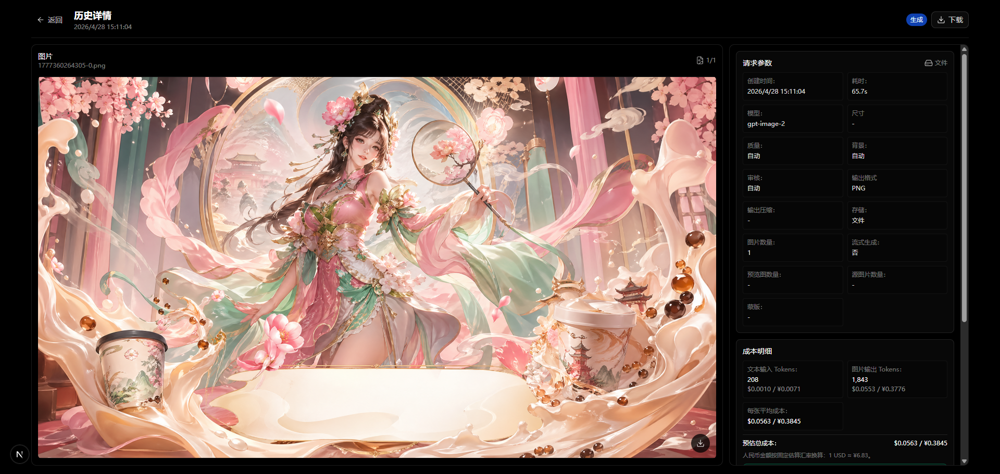
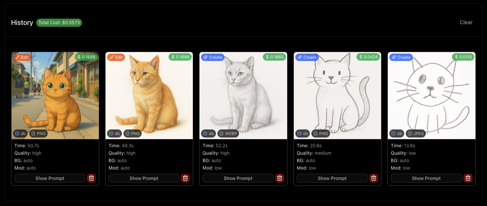
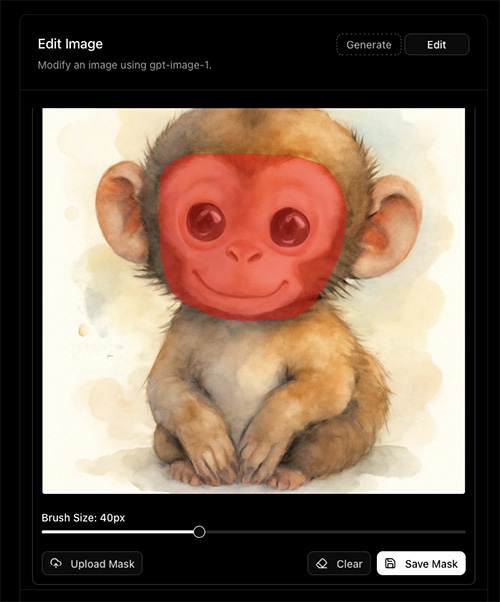
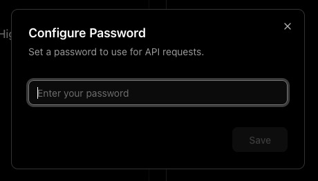

<div align="center">
  
  <h1>GPT Image Playground</h1>
  <p>基于 Next.js 的 GPT Image 生成与编辑工作台</p>
  <p>支持 OpenAI 兼容接口、图片生成、图片编辑、历史详情、成本估算、人民币换算与本站额度价值对比。</p>
  <p>
    
    
    
  </p>
  <p>
    
    
    
    
  </p>
</div>

## 项目简介

GPT Image Playground 是一个面向 `gpt-image-2` 的图片生成与编辑页面。它默认使用 `https://api.774966.xyz/v1`，默认模型为 `gpt-image-2`，也可以在页面右上角的设置页里修改 Base URL、API Key 和模型列表。

设置内容只会保存在当前浏览器的 `localStorage` 中，不会做服务器持久化存储。发起生成或编辑时，浏览器会把当前配置发送给本应用后端接口，用于请求你配置的 OpenAI 兼容 API。

<p align="center">
  
</p>

## 功能特性

- 图片生成：输入提示词生成图片，支持多图批量输出。
- 图片编辑：上传或粘贴参考图，使用提示词进行编辑。
- 蒙版工具：可在页面内绘制蒙版，也可以上传 PNG 蒙版。
- 尺寸选择：默认 `1:1`，支持 `16:9`、`9:16` 和自定义尺寸。
- 模型设置：可在设置页添加多个模型 ID，首页模型下拉框自动使用这些配置。
- 接口设置：支持自定义 Base URL、API Key；Base URL 留空时默认使用 `https://api.774966.xyz/v1`。
- 主题与语言：支持中文 / English，默认跟随系统语言；主题支持浅色、深色和跟随系统。
- 实时计时：点击生成后会显示本次请求已耗时。
- 图片预览与下载：生成结果、历史列表和详情页均支持下载图片。
- 历史记录：历史元数据保存在浏览器 localStorage，图片可保存在服务端文件系统或浏览器 IndexedDB。
- 历史详情页：查看图片、提示词、请求参数、耗时、模型、尺寸、格式、成本和额度对比。
- 成本估算：按 API usage 和模型 token 单价估算美元成本，并显示人民币换算。
- 额度价值对比：按本站 `¥1 = 20 张图` 计算单图 `¥0.05`，对比官方估算成本，展示大约节省金额和划算倍数。

## 历史与成本

历史列表会记录每次生成或编辑的关键信息，包括模型、尺寸、质量、背景、审核级别、输出格式、耗时、图片数量、提示词和成本明细。

<p align="center">
  
</p>

成本展示包含三类信息：

- 官方估算成本：根据接口返回的 usage 与模型单价计算。
- 人民币换算：使用固定估算汇率展示 `USD / RMB`。
- 本站额度价：按 `¥1 = 20 张图` 计算，帮助用户直观看到额度价值。

> 说明：官方价格常量写在 `src/lib/cost-utils.ts` 中，不会实时抓取官方价格；如官方定价变化，需要同步更新该文件。

<p align="center">
  
</p>

## 蒙版编辑

编辑模式支持直接在图片上涂抹生成蒙版，适合指定局部修改区域。

<p align="center">
  
</p>

## 存储说明

项目支持两种图片存储模式，通过 `NEXT_PUBLIC_IMAGE_STORAGE_MODE` 控制：

- `fs`：默认模式，图片保存到服务端 `generated-images` 目录。
- `indexeddb`：图片保存到当前浏览器 IndexedDB，适合 Vercel 等无持久文件系统的部署环境。

历史元数据始终保存在浏览器 `localStorage`，不会保存到线上数据库。清空浏览器数据、切换浏览器或切换设备后，历史记录不会同步。

## Docker 一键部署

已发布 Docker Hub 双架构镜像，支持 `linux/amd64` 和 `linux/arm64`：

```text
tannic666/gpt-image-2-webui:latest
```

推荐使用 Docker Compose 部署，默认会直接拉取 Docker Hub 镜像：

```bash
docker compose up -d
```

启动后访问：

```text
http://服务器IP:3000
```

默认会把容器内的图片目录挂载到宿主机：

```text
./generated-images:/app/generated-images
```

这样在默认 `fs` 存储模式下，生成图片会持久保存在宿主机的 `generated-images` 目录。

### Docker 环境变量

可以在项目根目录创建 `.env` 文件：

```dotenv
PORT=3000
OPENAI_API_KEY=your_api_key_here
OPENAI_API_BASE_URL=https://api.774966.xyz/v1
NEXT_PUBLIC_IMAGE_STORAGE_MODE=fs
APP_PASSWORD=
```

然后启动：

```bash
docker compose up -d
```

如果你希望用户在页面设置里自行填写 API Key，`OPENAI_API_KEY` 可以留空。

也可以不克隆源码，直接使用 `docker run`：

```bash
docker run -d --name gpt-image-2-webui --restart unless-stopped -p 3000:3000 -e OPENAI_API_BASE_URL=https://api.774966.xyz/v1 -e NEXT_PUBLIC_IMAGE_STORAGE_MODE=fs -v ${PWD}/generated-images:/app/generated-images tannic666/gpt-image-2-webui:latest
```

常用 Docker 命令：

```bash
# 查看日志
docker compose logs -f

# 重启
docker compose restart

# 停止
docker compose down

# 更新 Docker Hub 镜像
docker compose pull
docker compose up -d

# 如需从源码本地构建
docker build -t gpt-image-2-webui:local .

# 如需构建 IndexedDB 存储模式镜像
docker build --build-arg NEXT_PUBLIC_IMAGE_STORAGE_MODE=indexeddb -t gpt-image-2-webui:indexeddb .
```

## 本地开发

### 环境要求

- Node.js 20 或更高版本
- npm

### 安装依赖

```bash
npm install
```

### 启动开发服务

```bash
npm run dev
```

启动后访问：

```text
http://localhost:3000
```

## API 配置

你可以直接在页面右上角设置页填写 API Key、Base URL 和模型列表。也可以使用环境变量配置服务端默认值。

### `.env.local` 示例

```dotenv
OPENAI_API_KEY=your_api_key_here
OPENAI_API_BASE_URL=https://api.774966.xyz/v1
```

如果 `OPENAI_API_BASE_URL` 不填写，服务端默认使用：

```text
https://api.774966.xyz/v1
```

如果设置页里的 Base URL 留空，前端同样会默认使用：

```text
https://api.774966.xyz/v1
```

## 可选配置

### IndexedDB 模式

适合部署到 Vercel 等服务端文件系统不可持久保存的环境：

```dotenv
NEXT_PUBLIC_IMAGE_STORAGE_MODE=indexeddb
```

未设置时，本地默认使用 `fs`。如果部署环境检测到 Vercel，项目会默认使用 `indexeddb`。

Docker Hub 镜像 `tannic666/gpt-image-2-webui:latest` 默认按 `fs` 模式构建；如果需要 Docker 环境使用 `indexeddb`，请按上面的源码构建命令重新构建镜像。

### 访问密码

可以配置一个简单的应用密码：

```dotenv
APP_PASSWORD=your_password_here
```

启用后，前端会要求输入密码再发起生成请求。

<p align="center">
  
</p>

## 常用命令

```bash
# 开发
npm run dev

# 代码检查
npm run lint

# 生产构建
npm run build

# 启动生产服务
npm run start
```

## 目录结构

```text
src/
  app/                 Next.js App Router 页面与 API
  components/          页面组件与 UI 组件
  lib/                 设置、i18n、成本、尺寸、IndexedDB 等工具
public/                静态资源
readme-images/         README 截图
generated-images/      fs 模式下的图片输出目录
```

## 注意事项

- API Key 请妥善保存，不要提交到仓库。
- 设置页保存的是浏览器本地配置，不是账号级云端配置。
- IndexedDB 模式下，图片只在当前浏览器中可用。
- `generated-images` 目录适合本地或有持久磁盘的服务器，不适合无状态 Serverless 持久存储。
- 官方成本只是估算值，实际账单以接口服务商结算为准。

## License

MIT
